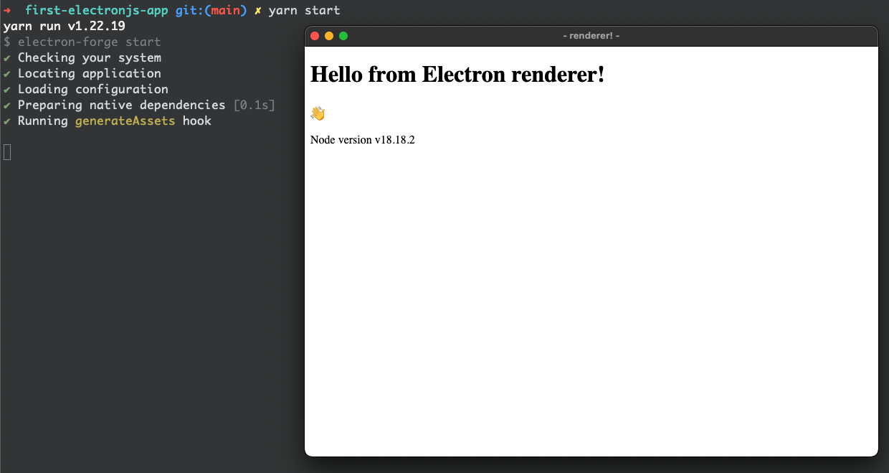

# Electron js app

This is how it looks like in Mac


## What tools am I using? 
- html
- css
- javascript
- node
- yarn
- electron, electron-forge
- visual studio code

## Debugging with VS Code
1. mkdir .vscode
2. vim launch.json
```json
{
    "version": "0.2.0",
    "compounds": [
        {
            "name": "Main + Renderer",
            "configurations": ["Electron Main", "Renderer"],
            "stopAll": true 
        }
    ],
    "configurations": [
        {
            "name": "Renderer",
            "port": 9222,
            "request": "attach",
            "skipFiles": [
                "<node_internals>/**"
            ],
            "type": "chrome",
            "webRoot": "${workspaceFolder}"
        },
        {
            "name": "Electron Main",
            "program": "${workspaceFolder}/main.js",
            "request": "launch",
            "runtimeExecutable": "${workspaceFolder}/node_modules/.bin/electron",
            "skipFiles": [
                "<node_internals>/**"
            ],
            "type": "node",
            "args": [".", "--remote-debugging-port=9222"],
            "outputCapture": "std",
            "console": "integratedTerminal"
        }

    ]
}
```
3. Click Rung & Debug